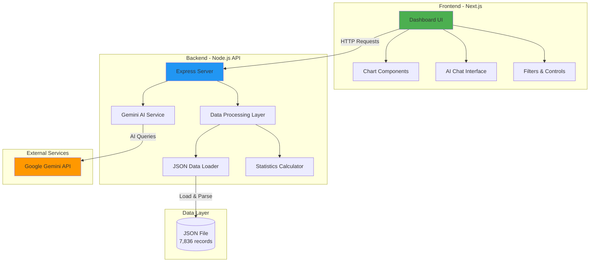

# Near Miss Data Analysis Dashboard - Implementation Plan

## Executive Summary

Building an interactive dashboard to visualize and analyze 7,836 near-miss incident records from construction sites. The solution will use **Next.js** for the frontend, **Node.js/Express** for the backend API, and **Google Gemini API** for AI-powered insights.

---

## 1. Data Analysis Findings

### Dataset Overview
- **Total Records**: 7,836 incidents
- **File Size**: ~5.6 MB JSON
- **Time Range**: 2024 (full year coverage)
- **Format**: MongoDB export with nested objects

### Key Data Fields Identified

| Field | Type | Purpose | Sample Values |
|-------|------|---------|---------------|
| `incident_number` | String | Unique identifier | "135774577" |
| `incident_date` | Timestamp | When incident occurred | 1706868529000 |
| `severity_level` | Integer | Risk severity (0-4) | 0, 1, 2, 3, 4 |
| `primary_category` | String | Incident type | "Dropped Objects", "Energy Isolation", "Work at Height" |
| `action_cause` | String | Root cause | "Dropped Object(s)", "Slip/Trip", "Other" |
| `region` | String | Geographic location | "Asia (North Asia)", "Asia Pacific (Southeast Asia)" |
| `gbu` | String | Business unit | "Energy" |
| `job` | String | Project name | "Project A", "Project E" |
| `location` | String | Specific site area | "Area 42", "Tank 107" |
| `behavior_type` | String | Risk behavior | "At-Risk" |
| `unsafe_condition_or_behavior` | String | Classification | "Unsafe Condition", "Behavior" |
| `company_type` | String | Company classification | "B", "N" |
| `craft_code` | String | Worker role | "Laborers", "Welder", "Pipefitters" |
| `month`, `week`, `day_of_year`, `year` | Integer | Time dimensions | Pre-calculated for analysis |
| `is_lcv` | Boolean | Life-changing violation flag | true/false |

### Data Quality Observations
- ✅ All records have timestamps and basic identifiers
- ⚠️ Some fields have empty strings (`""`) - need graceful handling
- ✅ Time dimensions pre-calculated (month, week, day_of_year)
- ✅ Severity levels are standardized (0-4 scale)

---

## 2. Technology Stack

### Frontend: **Next.js 14** (App Router)
**Why Next.js?**
- ✅ Server-side rendering for better performance
- ✅ Built-in API routes (can serve as BFF - Backend for Frontend)
- ✅ Excellent developer experience with React
- ✅ Easy deployment to Vercel
- ✅ TypeScript support out of the box

**Key Libraries:**
- **Chart.js / Recharts**: For data visualizations
- **TailwindCSS**: For styling
- **SWR / TanStack Query**: For data fetching and caching
- **Framer Motion**: For smooth animations
- **date-fns**: For date manipulation

### Backend: **Node.js + Express**
**Why Node.js?**
- ✅ JavaScript ecosystem consistency
- ✅ Fast JSON processing
- ✅ Easy integration with Next.js
- ✅ Great for REST APIs

**Key Libraries:**
- **Express**: Web framework
- **CORS**: Cross-origin resource sharing
- **dotenv**: Environment configuration
- **node-cache**: In-memory caching for performance

### AI Integration: **Google Gemini API**
**Why Gemini?**
- ✅ **Free tier available** (perfect for assignment)
- ✅ Excellent for data analysis and Q&A
- ✅ Supports structured data understanding
- ✅ Fast response times
- ✅ Good context window for dataset analysis

**Alternative Considered:**
- OpenAI GPT: More expensive, requires payment
- **Gemini is the better choice** for this project

---

## 3. Architecture Design



### API Endpoints Design

| Endpoint | Method | Purpose | Response |
|----------|--------|---------|----------|
| `/api/incidents` | GET | Fetch all incidents (with pagination) | Array of incidents |
| `/api/incidents/:id` | GET | Get single incident details | Single incident object |
| `/api/stats/overview` | GET | Dashboard summary statistics | Aggregated counts |
| `/api/stats/severity` | GET | Severity distribution | Chart data |
| `/api/stats/categories` | GET | Category breakdown | Chart data |
| `/api/stats/trends` | GET | Time-based trends | Time series data |
| `/api/stats/regions` | GET | Regional distribution | Geographic data |
| `/api/ai/query` | POST | AI-powered Q&A | Natural language response |
| `/api/ai/insights` | GET | Auto-generated insights | AI analysis |

---

## 4. Visualization Strategy (5+ Charts)

### Chart 1: **Severity Level Distribution** (Donut Chart)
- **Purpose**: Show proportion of incidents by severity (0-4)
- **Data**: Aggregate count by `severity_level`
- **Library**: Recharts PieChart
- **Insight**: Identify most common risk levels

### Chart 2: **Monthly Incident Trends** (Line Chart)
- **Purpose**: Track incidents over time
- **Data**: Count by `month` and `year`
- **Library**: Recharts LineChart
- **Insight**: Identify seasonal patterns or improvements

### Chart 3: **Top Incident Categories** (Horizontal Bar Chart)
- **Purpose**: Show most common incident types
- **Data**: Count by `primary_category`
- **Library**: Recharts BarChart
- **Insight**: Focus safety efforts on top categories

### Chart 4: **Regional Distribution** (Bar Chart)
- **Purpose**: Compare incidents across regions
- **Data**: Count by `region`
- **Library**: Recharts BarChart
- **Insight**: Identify high-risk locations

### Chart 5: **Behavior vs Condition** (Stacked Bar Chart)
- **Purpose**: Compare unsafe behaviors vs conditions
- **Data**: Count by `unsafe_condition_or_behavior` over time
- **Library**: Recharts BarChart (stacked)
- **Insight**: Understand root causes

### Chart 6: **Weekly Heatmap** (Calendar Heatmap)
- **Purpose**: Visualize incident density by week
- **Data**: Count by `week` and `day_of_year`
- **Library**: Custom D3.js or react-calendar-heatmap
- **Insight**: Identify high-risk periods

### Chart 7: **Action Cause Breakdown** (Treemap)
- **Purpose**: Hierarchical view of causes
- **Data**: Count by `action_cause`
- **Library**: Recharts Treemap
- **Insight**: Drill down into specific causes

---

## 5. AI Integration with Gemini

### Use Cases

#### 1. **Natural Language Q&A**
Users can ask questions like:
- "What were the most common incidents in March 2024?"
- "Which region has the highest severity incidents?"
- "Show me trends for dropped objects"

**Implementation:**
```javascript
// Backend: /api/ai/query
const response = await geminiAPI.generateContent({
  prompt: `Given this near-miss incident data summary: ${dataContext}
           User question: ${userQuery}
           Provide a clear, data-driven answer.`,
  context: aggregatedStats
});
```

#### 2. **Automated Insights Generation**
Generate insights on page load:
- "⚠️ Dropped Objects incidents increased 23% in Q2"
- "✅ Severity Level 4 incidents decreased by 15% this month"
- "📍 Asia (North Asia) region needs attention - 45% of all incidents"

**Implementation:**
```javascript
// Backend: /api/ai/insights
const insights = await geminiAPI.generateContent({
  prompt: `Analyze this construction safety data and provide 3-5 key insights:
           ${JSON.stringify(statistics)}
           Focus on trends, risks, and actionable recommendations.`
});
```

#### 3. **Predictive Recommendations**
- Suggest safety interventions based on patterns
- Identify high-risk periods for preventive measures

### Gemini API Setup

```javascript
// backend/services/geminiService.js
import { GoogleGenerativeAI } from "@google/generative-ai";

const genAI = new GoogleGenerativeAI(process.env.GEMINI_API_KEY);
const model = genAI.getGenerativeModel({ model: "gemini-pro" });

export async function queryGemini(prompt, context) {
  const fullPrompt = `${context}\n\nQuestion: ${prompt}`;
  const result = await model.generateContent(fullPrompt);
  return result.response.text();
}
```

**Environment Variable:**
```env
GEMINI_API_KEY=your_api_key_here
```

**Get API Key:** https://makersuite.google.com/app/apikey

---

## 6. Performance Optimizations

### Backend
1. **In-Memory Caching**: Cache processed statistics
   ```javascript
   const NodeCache = require('node-cache');
   const cache = new NodeCache({ stdTTL: 600 }); // 10 min cache
   ```

2. **Lazy Loading**: Load JSON only once on server start
3. **Pagination**: Limit API responses to 100 records per page
4. **Compression**: Use gzip for API responses

### Frontend
1. **Code Splitting**: Lazy load chart components
2. **SWR Caching**: Cache API responses client-side
3. **Virtualization**: Use react-window for large lists
4. **Debouncing**: Debounce filter changes

---

## 7. Error Handling Strategy

### Missing/Empty Data
```javascript
// Handle empty strings and null values
const safeValue = data.primary_category || "Uncategorized";
const severityLevel = data.severity_level ?? 0;
```

### API Error Handling
```javascript
// Backend
app.use((err, req, res, next) => {
  console.error(err.stack);
  res.status(500).json({ 
    error: "Internal server error",
    message: process.env.NODE_ENV === 'development' ? err.message : undefined
  });
});

// Frontend
const { data, error } = useSWR('/api/stats', fetcher, {
  onError: (err) => toast.error("Failed to load data")
});
```

---

## 8. Project Structure

```
near-miss-dashboard/
├── backend/
│   ├── server.js                 # Express server entry
│   ├── routes/
│   │   ├── incidents.js          # Incident endpoints
│   │   ├── stats.js              # Statistics endpoints
│   │   └── ai.js                 # AI endpoints
│   ├── services/
│   │   ├── dataService.js        # Data processing
│   │   └── geminiService.js      # AI integration
│   ├── utils/
│   │   ├── dataLoader.js         # JSON loader
│   │   └── aggregations.js       # Statistical functions
│   ├── data/
│   │   └── db.dashboard_incidents.json
│   └── package.json
│
├── frontend/
│   ├── app/
│   │   ├── page.tsx              # Main dashboard
│   │   ├── layout.tsx            # Root layout
│   │   └── api/                  # Next.js API routes (optional)
│   ├── components/
│   │   ├── charts/
│   │   │   ├── SeverityChart.tsx
│   │   │   ├── TrendChart.tsx
│   │   │   ├── CategoryChart.tsx
│   │   │   └── RegionChart.tsx
│   │   ├── ui/
│   │   │   ├── StatCard.tsx
│   │   │   ├── FilterPanel.tsx
│   │   │   └── LoadingSpinner.tsx
│   │   └── AIChat.tsx
│   ├── lib/
│   │   ├── api.ts                # API client
│   │   └── utils.ts              # Helper functions
│   ├── public/
│   └── package.json
│
└── README.md
```

---

## 9. Development Timeline

| Phase | Tasks | Duration |
|-------|-------|----------|
| **Setup** | Initialize projects, install dependencies | 30 min |
| **Backend** | API development, data processing | 2 hours |
| **Frontend** | Dashboard UI, charts, styling | 3 hours |
| **AI Integration** | Gemini setup, Q&A feature | 1 hour |
| **Testing** | Bug fixes, performance tuning | 1 hour |
| **Documentation** | README, comments, deployment | 30 min |
| **Total** | | **~8 hours** |

---

## 10. Deployment Strategy

### Option 1: **Vercel (Recommended)**
- **Frontend**: Deploy Next.js to Vercel (free tier)
- **Backend**: Deploy as Vercel Serverless Functions
- **Pros**: Zero config, automatic HTTPS, fast CDN
- **Cons**: Serverless cold starts

### Option 2: **Render / Railway**
- **Full-stack**: Deploy both frontend and backend
- **Pros**: Always-on server, no cold starts
- **Cons**: Requires more configuration

### Option 3: **Docker + Cloud Run**
- **Container**: Dockerize entire application
- **Pros**: Portable, scalable
- **Cons**: More complex setup

**Recommended: Vercel** for simplicity and assignment requirements.

---

## 11. Testing Checklist

- [ ] Load full dataset without crashes
- [ ] Handle missing/empty fields gracefully
- [ ] All 5+ charts render correctly
- [ ] Responsive design works on mobile
- [ ] AI queries return relevant answers
- [ ] API endpoints return correct data
- [ ] Loading states display properly
- [ ] Error messages are user-friendly
- [ ] Performance: Dashboard loads < 3 seconds

---

## 12. README Structure

```markdown
# Near Miss Data Analysis Dashboard

## Overview
Interactive dashboard for analyzing 7,836 construction near-miss incidents.

## Features
- 📊 7 interactive charts
- 🤖 AI-powered Q&A with Gemini
- 📱 Responsive design
- ⚡ Fast performance with caching

## Tech Stack
- Frontend: Next.js 14, Recharts, TailwindCSS
- Backend: Node.js, Express
- AI: Google Gemini API

## Setup Instructions
1. Clone repository
2. Install dependencies: `npm install`
3. Set environment variables
4. Run backend: `cd backend && npm start`
5. Run frontend: `cd frontend && npm run dev`

## Environment Variables
GEMINI_API_KEY=your_key
PORT=5000

## Live Demo
[Link to deployed app]

## Screenshots
[Dashboard images]
```

---

## 13. Success Criteria

✅ **Functional Requirements**
- Loads 7,836 records without crashing
- Displays minimum 5 meaningful charts
- Handles missing data gracefully
- Clean, readable UI

✅ **Technical Requirements**
- Next.js frontend
- Node.js backend
- Gemini AI integration
- Deployed and accessible

✅ **Code Quality**
- Well-structured code
- Clear comments
- Comprehensive README
- GitHub repository

---

## Next Steps

1. **Get Approval**: Review this plan with user
2. **Setup Projects**: Initialize Next.js and Node.js
3. **Backend First**: Build API with data processing
4. **Frontend Development**: Create dashboard and charts
5. **AI Integration**: Add Gemini-powered features
6. **Testing & Deployment**: Verify and deploy

---

> **Ready to proceed?** This plan provides a complete roadmap for building a production-ready Near Miss Dashboard that meets all assignment requirements and showcases technical skills effectively.
